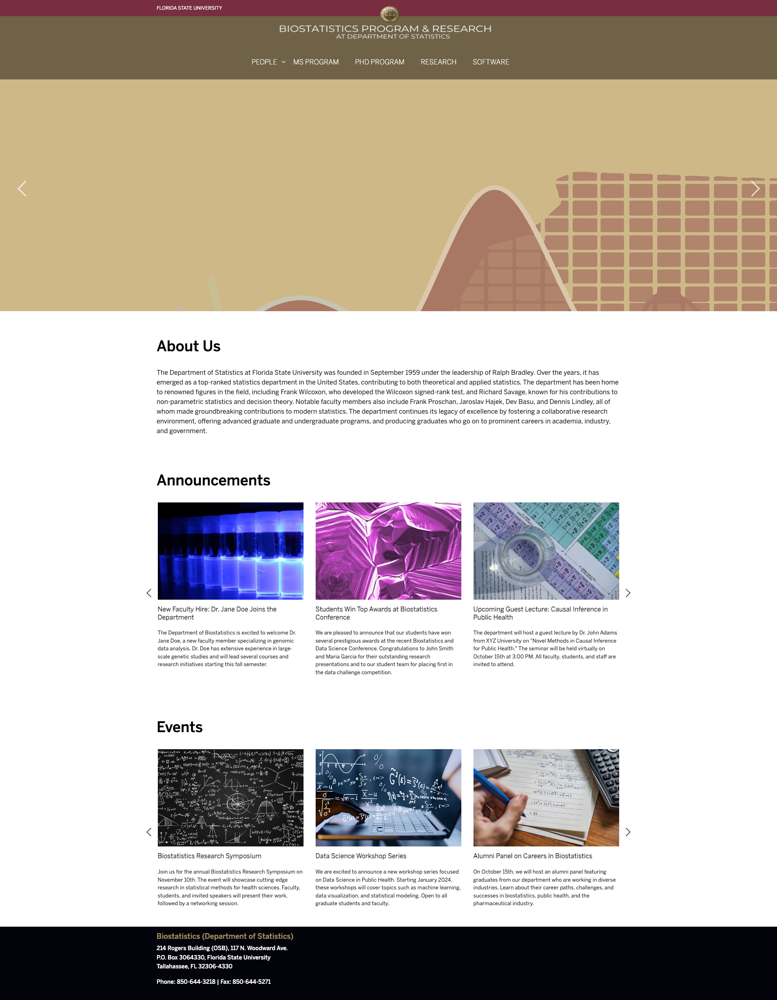
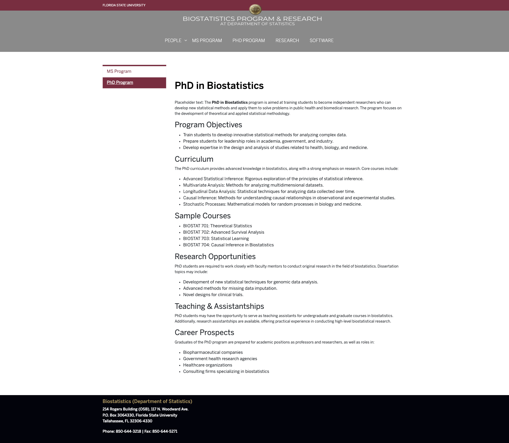
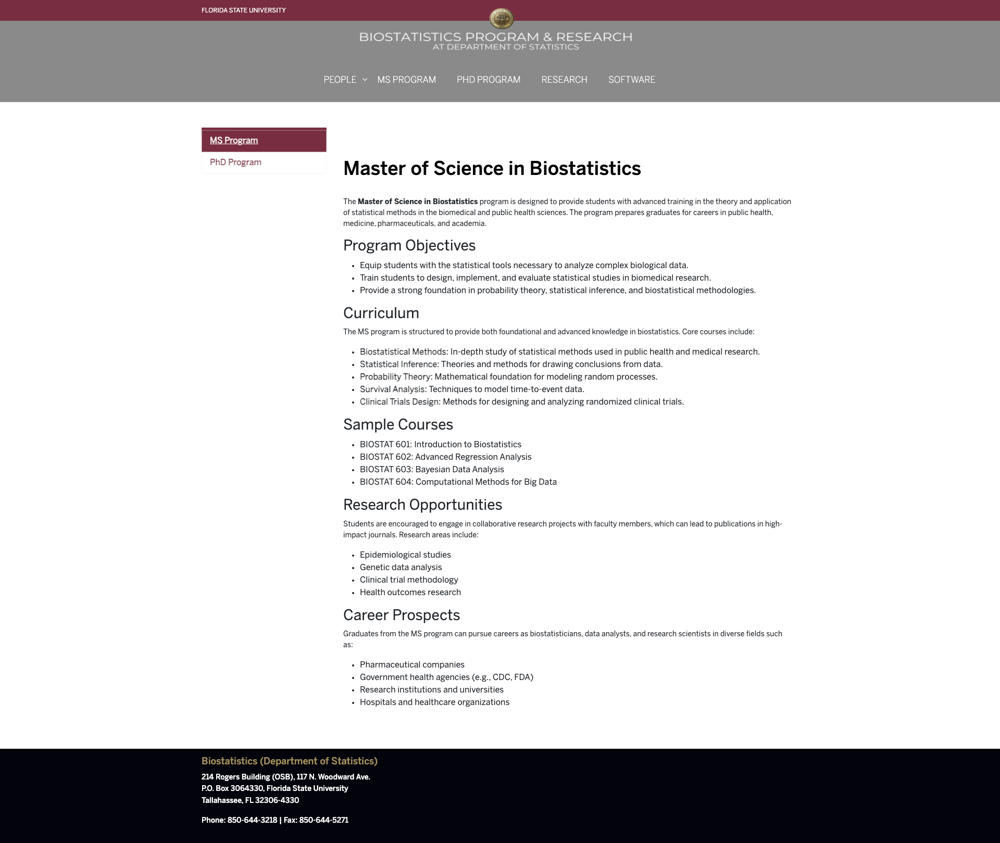
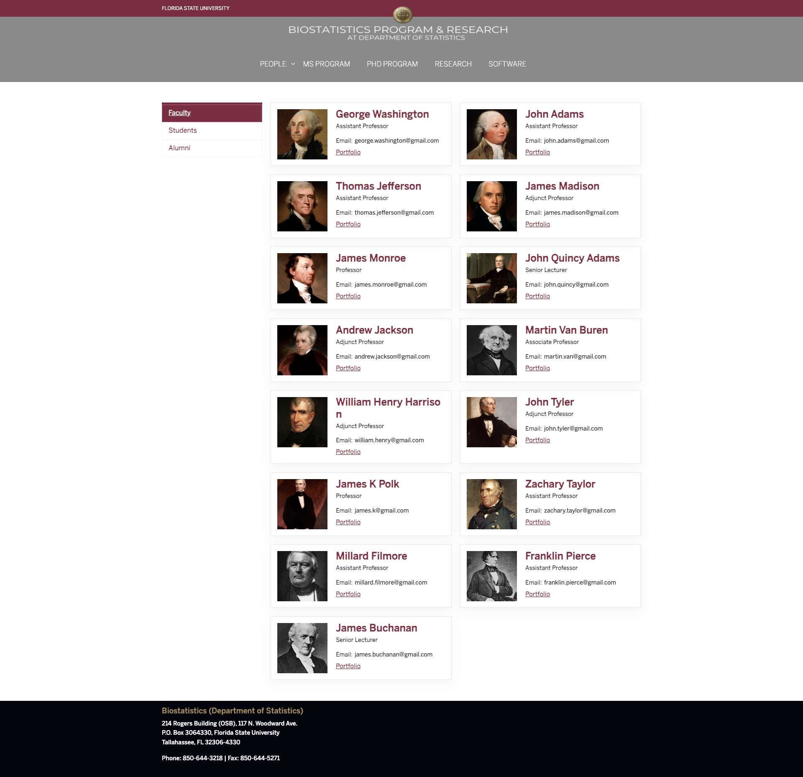
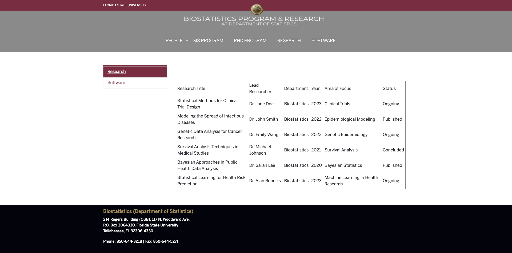
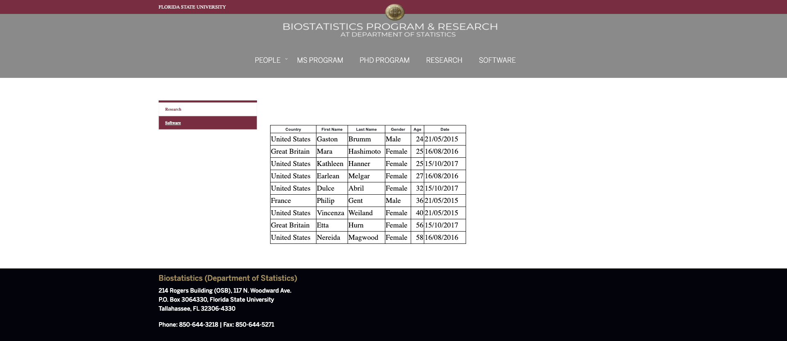

# Website Biostatistics

## Overview

This repository contains the code and resources for a website I developed as a Graduate Technology Assistant. The website supports the Biostatistics department by providing educational content, tools, and resources for students and faculty.

## Features

- **Educational Resources**: Articles and tutorials on biostatistical methods.
- **Interactive Tools**: Calculators and visual aids for statistical concepts.
- **User-Friendly Design**: Accessible layout and navigation.

## Screenshots
### Homepage

### PhD program

### MS Program

### Faculty

### Students

### Alumni

### Research

### Software

